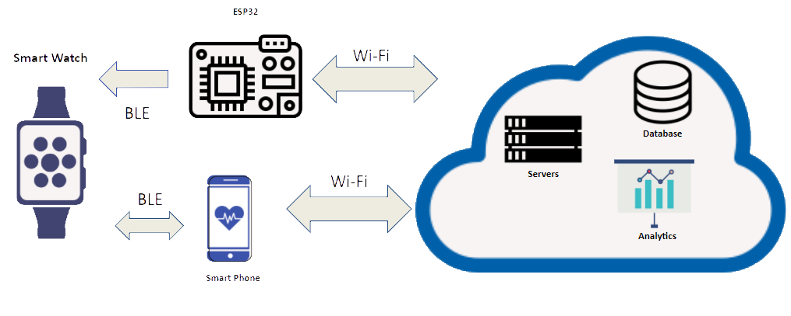

# Ecare
Main Repository for the ECare graduation project.

ECare is the gradution project of 5 graduating seniors from the American University in Cairo

# Vision
E-care is a system that continuously monitors elderly people’s health and wellbeing through smartwatches. The system mainly focuses on **Fall Detection** and **Indoor Localization**. Moreover,  the application also aims to  facilitate the **communication** between the elderly and their caregivers by having a communication channel and providing real-time **health data and reports**.

# System Hardware Requirements

- Smart phone
- Fitbit Smartwatch
- ESP32 for IPS

# System Architecture

<table>
  <tr>
    <td  align="center"></td>
  </tr>

</table>

# System Users

### The system has two types of users:

- Patient
-- The patients are Elderly that the system is aimed to support
-- The patients are the users who will use the Smartwatch
-- The Patients have to have a fitbit account
- Caregiver
-- Caregivers can include personal Doctors, Caregivers and Family members
-- All Caregivers have the same functionality, as they all use the system to communicate with the Patients and view their health data

# System Features

- **Health Tracking:**
-- Heart Rate
-- Skin Temperature
-- Step Count and Calories Burnt
-- Sleeping Patterns
View How we got the health tracking via backend [here](https://github.com/Elderly-Care/Ecare/tree/main/backend)
- **Fall Detection**
-- Developed our own dataset for Fall Detection
-- Developed a machine learning model for Fall Detection
For more details about fall detection [click here](https://github.com/Elderly-Care/Ecare/tree/main/fallDetection)
- **Indoor Positioning System** for well-being monitoring
For more details about indoor poisitioning system from the ESP32 side [click here](https://github.com/Elderly-Care/Ecare/tree/main/ips)
For more details about indoor poisitioning system from the fitbit side [click here](https://github.com/Elderly-Care/Ecare/tree/main/fitbit)
- **Communication** Channel between patient and caregiver
This can be viewed from our frontend applications using [Android](https://github.com/Elderly-Care/Ecare/tree/main/androidApp) and [iOS](https://github.com/Elderly-Care/Ecare/tree/main/iOS)

